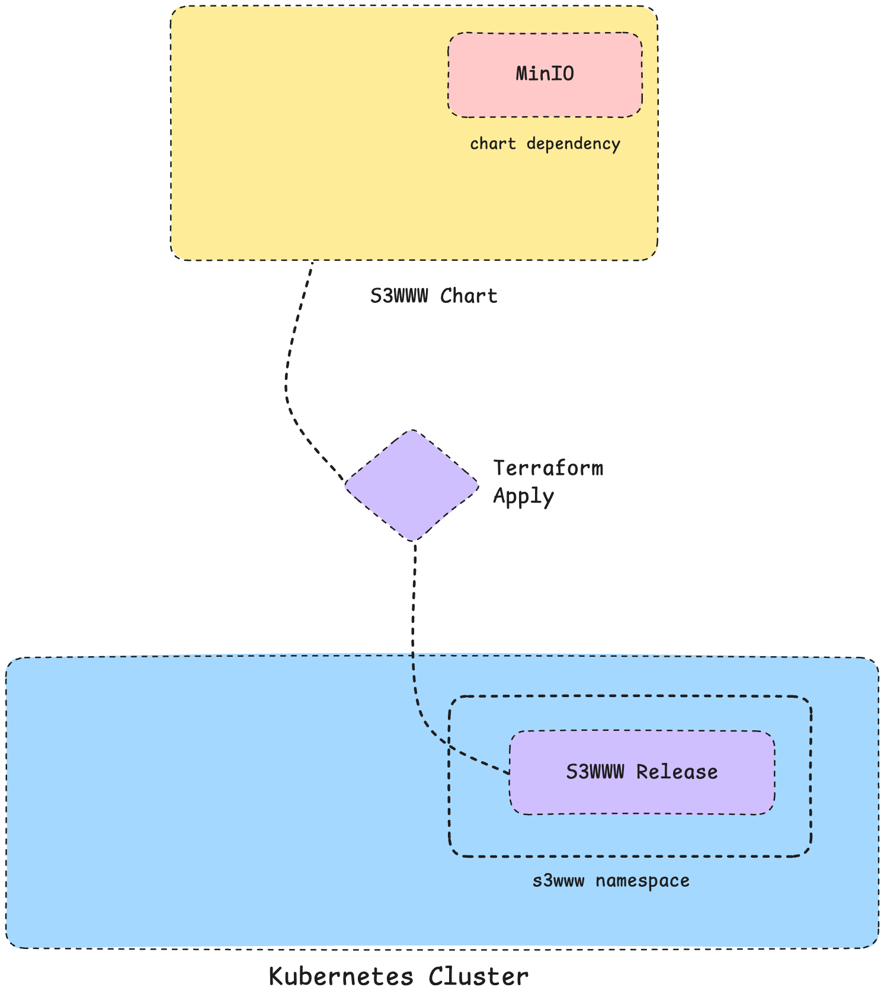
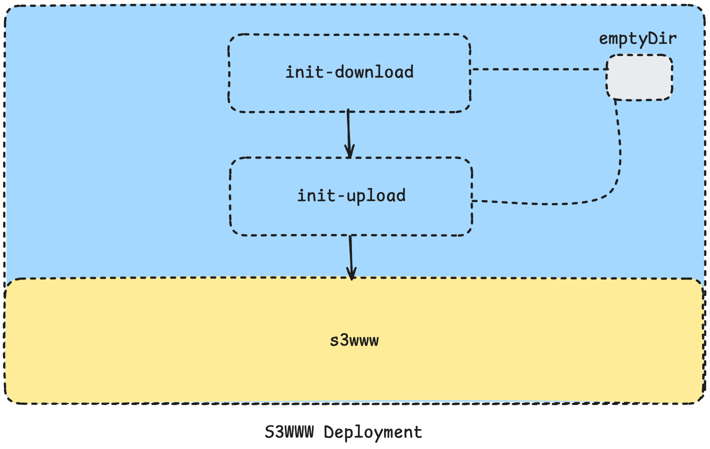

# s3www-deployment

This repo holds a deployment setup for the s3www app and its MinIO dependency, built with Helm and Terraform.

## Pre-requisites

* Kubernetes cluster
* Helm installed
* Terraform installed
* kubectl configured to access the cluster

##  Deployment

To deploy the s3www app with its MinIO dependency, follow these steps:

Initialize Terraform and create the namespace


```bash
cd deployment && kubectl create namespace terraform

terraform init

terraform apply
```
**Note**: This can improved by an automation script.

## Usage

After the deployment is complete, you can check the s3www app and MinIO using the following commands:

```bash
kubectl get pods,svc -n s3www
```

This will list all the pods and services in the `s3www` namespace, including the s3www app and MinIO.

if you have set `LoadBalancer` service or an Ingress, please use it or use port-forwarding to access the service:

```bash
kubectl port-forward svc/s3www 8080:8080 -n s3www
```

## Configuration

The configuration for the s3www app and its MinIO dependency is managed using Helm values files.

### Configuring S3www App

The whole config for the s3www app is defined in the section `config` in the values file.
```yaml
config:
  endpoint: "http://s3www-minio:9000"
  bucket: "s3www-data"
  accessKey: "s3www"
  secretKeySecret:
    name: s3www-secret
    key: secretKey
  address:  "0.0.0.0:8080"
```

### Expose S3www App

You can expose the s3www app using a `LoadBalancer` service or an Ingress resource.

```yaml
service:
  type: LoadBalancer
```

OR 

```yaml
ingress:
  enabled: true
  className: "nginx"
  hosts:
    - host: example.com
      paths:
        - path: /
          pathType: ImplementationSpecific
```

### Configuring MinIO

The MinIO configuration is defined in the `minio` section of the values file.

```yaml
minio:
  enabled: true
  mode: standalone
  rootUser: s3www-admin
  buckets:
    - name: s3www-data
      policy: none
      purge: false
```

You can add more buckets, policies, and users as needed by modifying the `minio` section in the values file.
for more information on how to configure MinIO, please refer to the [MinIO Helm Chart documentation](https://github.com/minio/minio/blob/master/helm/minio/README.md)

### Monitoring

The app expects that Prometheus Operator is installed in the cluster, it uses the `ServiceMonitor` resource to enable monitoring for the s3www app.
To enable monitoring for the s3www app and MinIO,

```yaml
monitoring:
  enabled: true
  serviceMonitor:
    enabled: true
```

To check more about the configuration options for the s3www app please refer to the [s3www Helm Chart documentation](./charts/s3www/README.md)

## Architecture

The following diagram illustrates the architecture of the s3www app and its MinIO dependency deployed on Kubernetes:

<div style="width:60%; margin: auto;">


</div>

The architecture consists of the following components:
- **s3www App**: The main application that interacts with MinIO for file storage.
- **MinIO**: The object storage service that provides S3-compatible APIs for the s3www app.

Terraform is used to manage the lifecycle of Helm releases for both the s3www app and its MinIO dependency.
The Helm charts are configured to deploy the s3www app with MinIO as a dependency, ensuring that MinIO is available when the s3www app starts.

### S3www App Specification

The s3www app is deployed using a Helm chart that includes the following specifications:
A Kubernetes deployment defines the following containers:

* **s3www**: The main application container that runs the s3www app.
* **init-download-file**: An init container that downloads a file to emptyDir to make it accessible for the upload.
* **init-upload-file**: An init container that uploads a file to MinIO using MinIO Client before the main application starts.

the following diagram illustrates the deployment of the s3www deployment:

<div style="width:40%; margin: auto;">


</div>


### Lifecycle Management

The lifecycle of the s3www app and its MinIO dependency is managed using Helm and Terraform.
The Helm charts are configured to ensure that MinIO is always available when the s3www app starts,
and the init containers handle the file upload process before the main application starts.

We use terraform to manage the Helm releases, ensuring that the deployment is consistent and can be easily updated or rolled back.

We define a generic [terraform module](./deployment/modules) for deploying helm releases,
which allows us to reuse the same module for many helm charts.

in this module, we allow the user to specify the chart name, chart path, and list of values files.

Example:
```hcl
module "helm-release" {
  source             = "./modules/helm-release"
  name               = "s3www"
  namespace          = "s3www"
  chart = "../charts/s3www"
  dependency_update = true

  values = [
    file("${path.module}/values/s3www-values.yaml"),
  ]
}

```

By following this approach, we can easily add values files for each environment or configuration,
ensuring that the deployment is flexible and can be tailored to specific needs.
